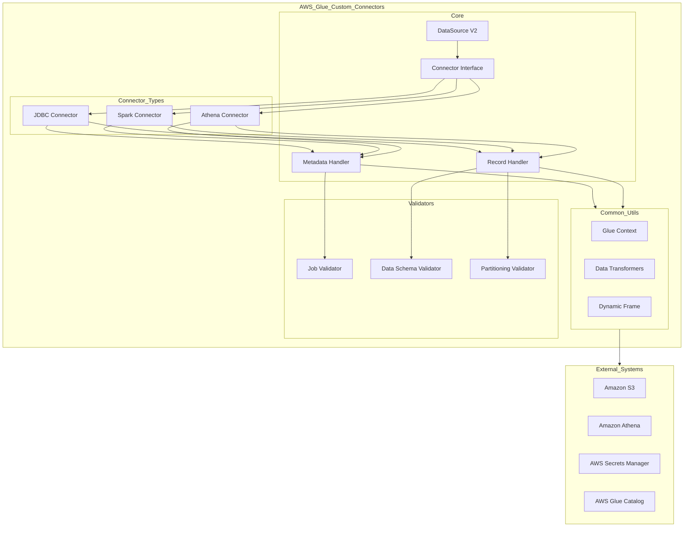

    

    <b>Automatic Architecture Diagrams from Code</b> 
    <a href="https://github.com/swark-io/swark">GitHub</a> • <a href="https://swark.io">Website</a> • <a href="mailto:contact@swark.io">Contact Us</a>

## Usage Instructions

1. **Render the Diagram**: Use the links below to open it in Mermaid Live Editor, or install the [Mermaid Support](https://marketplace.visualstudio.com/items?itemName=bierner.markdown-mermaid) extension.
2. **Recommended Model**: If available for you, use `claude-3.5-sonnet` [language model](vscode://settings/swark.languageModel). It can process more files and generates better diagrams.
3. **Iterate for Best Results**: Language models are non-deterministic. Generate the diagram multiple times and choose the best result.

## Generated Content
**Model**: Claude 3.5 Sonnet (Preview) - [Change Model](vscode://settings/swark.languageModel)  
**Mermaid Live Editor**: [View](https://mermaid.live/view#pako:eNqFlU1v2zAMhv-KoHN76W45DEidbd2AAkOddgc7MFibcYxZUqAPoGnR_z5Zij8k25iBGCT1mHwlkcgHLUWFdENzXks4n8j-PufEPsq8-sD2T1r8aA0WiVFasCIRnGOphVQeDOBESBzD3bMDDakwssRsNMnL3SHEuqw_uUZ5BEsONcgQi_hH1FDZfA_AqxZl1vvkGojwJyyFrHrYewso8irni9u66in2lzOqMPev3X3SAVlnjGikID2D_OswZ004EoJbfUIOjvTmYso1pS_QNvYcgttxIsWrW8qsMUKHhbsqT8jA3RXx9ir-G6RudCN4w-ts6ix-sX62jAlePOumjTR3XWf3rvFNZ51Nrk4kYy-Bq6OQDKXyuqeReIsXDqwpv0tgtiG9Q5wXS400D3q_vdmO5NAW6UVpZBPN6Zdsy-BdcGtNsvlb7Je8N1lOsZSoVWbnrLfJI3Cog87s9pXYXytqR_rz8IHDTOxk0m5vv4bD5Ykg5KC-jdfWhwZeA8bG9YR_92kdEk2tJ4bE68iYep1ZKBdM_VKxBSAqtUD4d6TBH-F1yDwRfOrWx_laI6ZT9L9q88GZ55sz_e2NcQfOu5reUDs_DJrK_jt85NSeC8OcbkhOKzyCaXVOPy1kzlYY7hqw48HoRkuDNxSMFumFl70vhalPdHOEVuHnP9qnC8U) | [Edit](https://mermaid.live/edit#pako:eNqFlU1v2zAMhv-KoHN76W45DEidbd2AAkOddgc7MFibcYxZUqAPoGnR_z5Zij8k25iBGCT1mHwlkcgHLUWFdENzXks4n8j-PufEPsq8-sD2T1r8aA0WiVFasCIRnGOphVQeDOBESBzD3bMDDakwssRsNMnL3SHEuqw_uUZ5BEsONcgQi_hH1FDZfA_AqxZl1vvkGojwJyyFrHrYewso8irni9u66in2lzOqMPev3X3SAVlnjGikID2D_OswZ004EoJbfUIOjvTmYso1pS_QNvYcgttxIsWrW8qsMUKHhbsqT8jA3RXx9ir-G6RudCN4w-ts6ix-sX62jAlePOumjTR3XWf3rvFNZ51Nrk4kYy-Bq6OQDKXyuqeReIsXDqwpv0tgtiG9Q5wXS400D3q_vdmO5NAW6UVpZBPN6Zdsy-BdcGtNsvlb7Je8N1lOsZSoVWbnrLfJI3Cog87s9pXYXytqR_rz8IHDTOxk0m5vv4bD5Ykg5KC-jdfWhwZeA8bG9YR_92kdEk2tJ4bE68iYep1ZKBdM_VKxBSAqtUD4d6TBH-F1yDwRfOrWx_laI6ZT9L9q88GZ55sz_e2NcQfOu5reUDs_DJrK_jt85NSeC8OcbkhOKzyCaXVOPy1kzlYY7hqw48HoRkuDNxSMFumFl70vhalPdHOEVuHnP9qnC8U)

