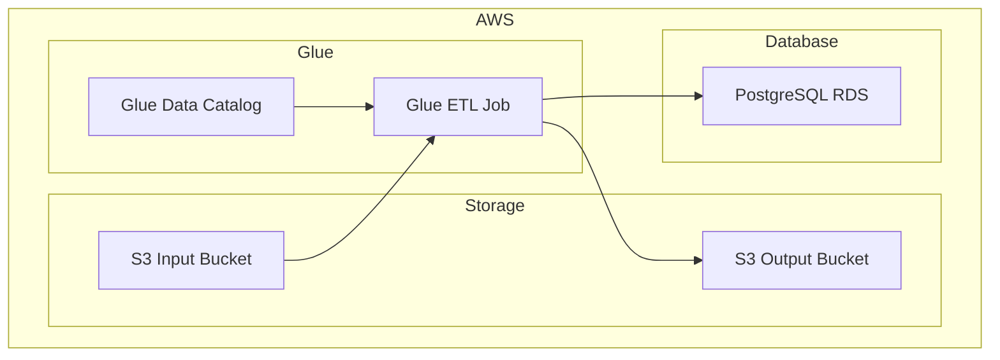

    

    <b>Automatic Architecture Diagrams from Code</b> 
    <a href="https://github.com/swark-io/swark">GitHub</a> • <a href="https://swark.io">Website</a> • <a href="mailto:contact@swark.io">Contact Us</a>

## Usage Instructions

1. **Render the Diagram**: Use the links below to open it in Mermaid Live Editor, or install the [Mermaid Support](https://marketplace.visualstudio.com/items?itemName=bierner.markdown-mermaid) extension.
2. **Recommended Model**: If available for you, use `claude-3.5-sonnet` [language model](vscode://settings/swark.languageModel). It can process more files and generates better diagrams.
3. **Iterate for Best Results**: Language models are non-deterministic. Generate the diagram multiple times and choose the best result.

## Generated Content
**Model**: Claude 3.5 Sonnet (Preview) - [Change Model](vscode://settings/swark.languageModel)  
**Mermaid Live Editor**: [View](https://mermaid.live/view#pako:eNqFUUtrwzAM_itC5_bUWw6DdRljo7CHCzvEYSiJmpQldnDkwyj973OaZtnSwnyxvgf6ZPmAuS0YI9SmdNRWsF1rA-F0PhuI23c1MH9YJdZRyZPSH7X6eDStl0St4FTA2uefLOmF7dnL2TdUoxEmJ5tCmyvJD7WfxfbMk82S_ob77QYCSC8tdyRU23KwxQHAmUn_D-3tGXWz4BfbSelYvW6SqYS3WM07zlqPe4Ll8macflB-zXldDOAk_OzwUppG0QYX2LBraF-ELz5olIob1hiBxoJ35GvReAwm3xYkHO8pPLfBSJznBZIXq75MPmJnfVlhtKO64-M30TOsdg) | [Edit](https://mermaid.live/edit#pako:eNqFUUtrwzAM_itC5_bUWw6DdRljo7CHCzvEYSiJmpQldnDkwyj973OaZtnSwnyxvgf6ZPmAuS0YI9SmdNRWsF1rA-F0PhuI23c1MH9YJdZRyZPSH7X6eDStl0St4FTA2uefLOmF7dnL2TdUoxEmJ5tCmyvJD7WfxfbMk82S_ob77QYCSC8tdyRU23KwxQHAmUn_D-3tGXWz4BfbSelYvW6SqYS3WM07zlqPe4Ll8macflB-zXldDOAk_OzwUppG0QYX2LBraF-ELz5olIob1hiBxoJ35GvReAwm3xYkHO8pPLfBSJznBZIXq75MPmJnfVlhtKO64-M30TOsdg)

