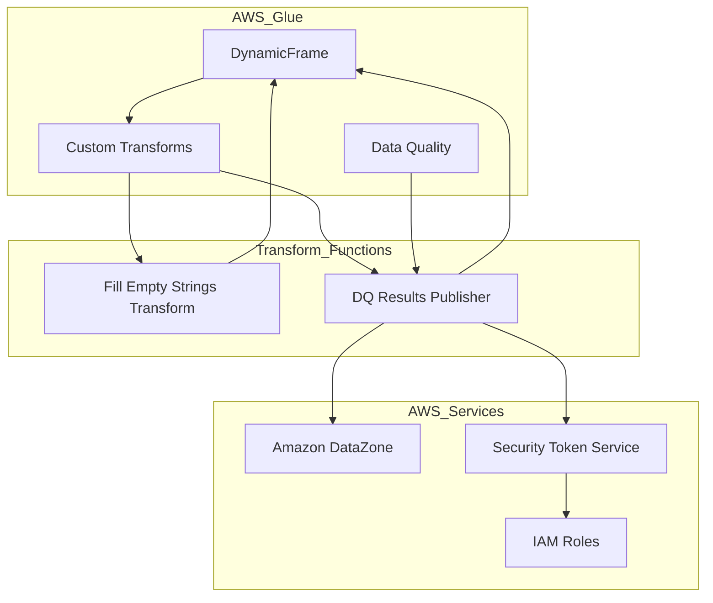

    

    <b>Automatic Architecture Diagrams from Code</b> 
    <a href="https://github.com/swark-io/swark">GitHub</a> • <a href="https://swark.io">Website</a> • <a href="mailto:contact@swark.io">Contact Us</a>

## Usage Instructions

1. **Render the Diagram**: Use the links below to open it in Mermaid Live Editor, or install the [Mermaid Support](https://marketplace.visualstudio.com/items?itemName=bierner.markdown-mermaid) extension.
2. **Recommended Model**: If available for you, use `claude-3.5-sonnet` [language model](vscode://settings/swark.languageModel). It can process more files and generates better diagrams.
3. **Iterate for Best Results**: Language models are non-deterministic. Generate the diagram multiple times and choose the best result.

## Generated Content
**Model**: Claude 3.5 Sonnet (Preview) - [Change Model](vscode://settings/swark.languageModel)  
**Mermaid Live Editor**: [View](https://mermaid.live/view#pako:eNp9k11LwzAUhv9KyPX2B3ohDOvEC8GtBcFURtaersF8jHwodey_my1xzVZtoJDz5jknb3LSA65VAzjDlWy5-qo7qi0q80oiP4zb7jTdd2jxWmweuYMgn0beSypYvdRUAEmD94G5d8YqUWoqTau0MCQIaFASOKeWrhzlzPbkNEcxiAjIppJ_uCpAf7IazHWhNyWBLAT9VvISJ3s9LZ6J_9BacUg9FGVBCqid9vuiUn2ARLH-hIvLaTZLJ2vLlEzMLBnnD2Jv-8JqJneGnAR0VlCUhgLpbazWYBy35sVtOTMdaJKvUNTQRRzbSluB5vO7URMCdque0VuzE-jYX4CjidFqSIqdmIR8D8K6n5wF36iYMLyQfz0E8vYgAU9uZtrmFYhnWIAWlDX-JzlU2HbgZZyhCjfQUp9e4aOH3L6hFnJG_asQOLPawQxTZ1XRy_o31srtOpy1lBs4_gAQUCtM) | [Edit](https://mermaid.live/edit#pako:eNp9k11LwzAUhv9KyPX2B3ohDOvEC8GtBcFURtaersF8jHwodey_my1xzVZtoJDz5jknb3LSA65VAzjDlWy5-qo7qi0q80oiP4zb7jTdd2jxWmweuYMgn0beSypYvdRUAEmD94G5d8YqUWoqTau0MCQIaFASOKeWrhzlzPbkNEcxiAjIppJ_uCpAf7IazHWhNyWBLAT9VvISJ3s9LZ6J_9BacUg9FGVBCqid9vuiUn2ARLH-hIvLaTZLJ2vLlEzMLBnnD2Jv-8JqJneGnAR0VlCUhgLpbazWYBy35sVtOTMdaJKvUNTQRRzbSluB5vO7URMCdque0VuzE-jYX4CjidFqSIqdmIR8D8K6n5wF36iYMLyQfz0E8vYgAU9uZtrmFYhnWIAWlDX-JzlU2HbgZZyhCjfQUp9e4aOH3L6hFnJG_asQOLPawQxTZ1XRy_o31srtOpy1lBs4_gAQUCtM)

