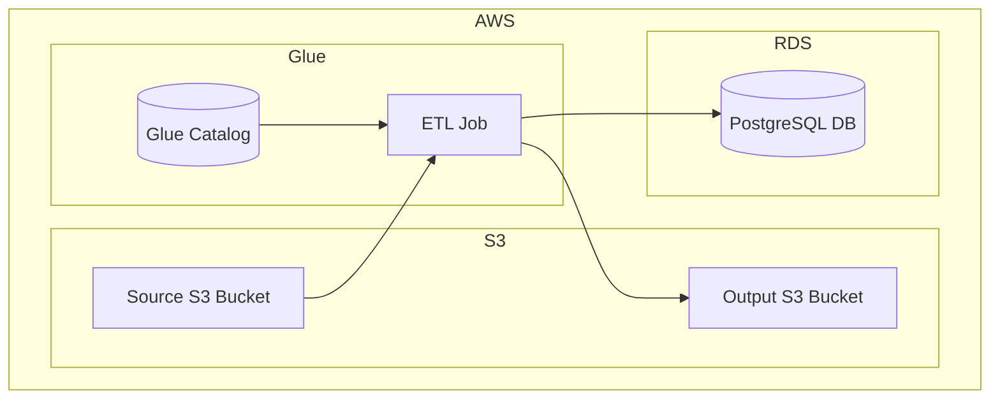

    

    <b>Automatic Architecture Diagrams from Code</b> 
    <a href="https://github.com/swark-io/swark">GitHub</a> • <a href="https://swark.io">Website</a> • <a href="mailto:contact@swark.io">Contact Us</a>

## Usage Instructions

1. **Render the Diagram**: Use the links below to open it in Mermaid Live Editor, or install the [Mermaid Support](https://marketplace.visualstudio.com/items?itemName=bierner.markdown-mermaid) extension.
2. **Recommended Model**: If available for you, use `claude-3.5-sonnet` [language model](vscode://settings/swark.languageModel). It can process more files and generates better diagrams.
3. **Iterate for Best Results**: Language models are non-deterministic. Generate the diagram multiple times and choose the best result.

## Generated Content
**Model**: Claude 3.5 Sonnet (Preview) - [Change Model](vscode://settings/swark.languageModel)  
**Mermaid Live Editor**: [View](https://mermaid.live/view#pako:eNqVUUtrwzAM_itGpw7aU285DNZlDEZhDxd2iEtxHMXplsTBkRij9L_PTZZ2gfQwn76XJVk-gHEZQgSqzkv3ZQrtSWxiVYtwWk6t100h7t5lr4xUubyIneHYG9y1y0R2KATEis0n0nYcdEwN0yn43KHJINbZhUx0fywZx2VtUHYfLk0eNmvx5NLthG006dLZZHa6Lu57dvOPtm-xHJdtXEvWY5vMXnokX9ciXk3W7MDvbodlicXi9jx67_2d9JodWGeddznhDaOpGuZQoa_0PgtffVBABVaoIBIKMsw1l6TgGELcZJow3uvw2Aoi8oxz0ExOftdm4N6xLSDKddni8QcfUq5P) | [Edit](https://mermaid.live/edit#pako:eNqVUUtrwzAM_itGpw7aU285DNZlDEZhDxd2iEtxHMXplsTBkRij9L_PTZZ2gfQwn76XJVk-gHEZQgSqzkv3ZQrtSWxiVYtwWk6t100h7t5lr4xUubyIneHYG9y1y0R2KATEis0n0nYcdEwN0yn43KHJINbZhUx0fywZx2VtUHYfLk0eNmvx5NLthG006dLZZHa6Lu57dvOPtm-xHJdtXEvWY5vMXnokX9ciXk3W7MDvbodlicXi9jx67_2d9JodWGeddznhDaOpGuZQoa_0PgtffVBABVaoIBIKMsw1l6TgGELcZJow3uvw2Aoi8oxz0ExOftdm4N6xLSDKddni8QcfUq5P)

