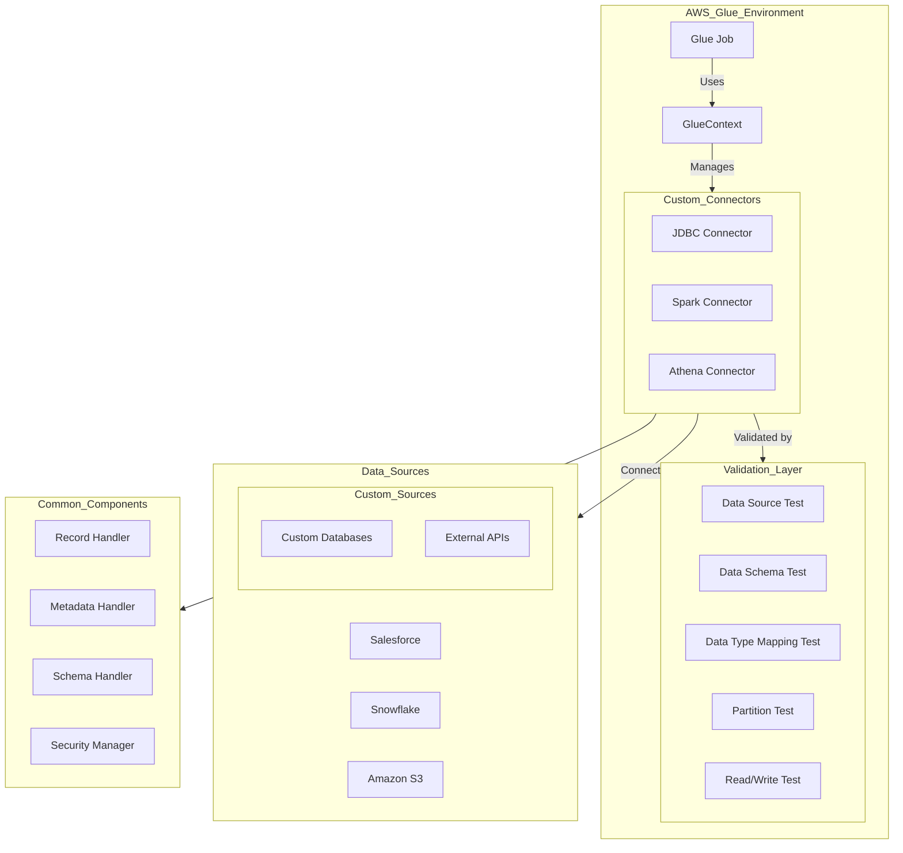

    

    <b>Automatic Architecture Diagrams from Code</b> 
    <a href="https://github.com/swark-io/swark">GitHub</a> • <a href="https://swark.io">Website</a> • <a href="mailto:contact@swark.io">Contact Us</a>

## Usage Instructions

1. **Render the Diagram**: Use the links below to open it in Mermaid Live Editor, or install the [Mermaid Support](https://marketplace.visualstudio.com/items?itemName=bierner.markdown-mermaid) extension.
2. **Recommended Model**: If available for you, use `claude-3.5-sonnet` [language model](vscode://settings/swark.languageModel). It can process more files and generates better diagrams.
3. **Iterate for Best Results**: Language models are non-deterministic. Generate the diagram multiple times and choose the best result.

## Generated Content
**Model**: Claude 3.5 Sonnet (Preview) - [Change Model](vscode://settings/swark.languageModel)  
**Mermaid Live Editor**: [View](https://mermaid.live/view#pako:eNqVlN9v2yAQx_8VxHOrPfQtD5PSuPtRLVpVZ-sDjqyLfUmsGrAwbPWa_u8DYzskJZPGg33f48NxmDu_0kKWSGc0EzsFzZ6skkwQO1qz8Y75U5p_rg3md-JXpaTgKLRH3HAzCyk0vmgW2OtT4l5u-llijWDqaE27LUyrJc9tGIGFlqo9Mm7cJ7cL5h5kItanRNqAemb9M2DIKTTXexTA_CsaCkX5zzx_Ql2VoCsp8m_QoTqNn4CGVBpV4ApbzZwkXhPnWEfoYo8cArrXl-hV1wSRnSJLaJpK7GIrHkDpyqXaL5lUDH1EKJ9UpX10pz708pydPs9knFWNSyz3Rw6uMIUa20_SOllvbp0ZhE2F_L2t4dlOj1Y4e8PmHP7YzNOb9eXaeberG9_tVavklnmmT28DLbZn57970agE1POHr2y0iRXt_5x9ITm3dWFfjRS2W4JUHrGQqvwCoqxRMa_IIIMtlqjBVheM4KgjqC-UERzKJoJhYexFdksQsHPgoMngWAdH8ubQt-T6-uPhh_1Sh7DXj8jg6DEfy5IXuvidu181tBKWZNMdLjRWfOUgiZaHSMHF1_ijRK6IXlGOikNV2r_ha0ZtwXDM6IxktMQtmFpn9M1CpnHJJhXYy-Z0ppXBKwpGy7QTxaiVNLs9nW2hbvHtLx1nvF0) | [Edit](https://mermaid.live/edit#pako:eNqVlN9v2yAQx_8VxHOrPfQtD5PSuPtRLVpVZ-sDjqyLfUmsGrAwbPWa_u8DYzskJZPGg33f48NxmDu_0kKWSGc0EzsFzZ6skkwQO1qz8Y75U5p_rg3md-JXpaTgKLRH3HAzCyk0vmgW2OtT4l5u-llijWDqaE27LUyrJc9tGIGFlqo9Mm7cJ7cL5h5kItanRNqAemb9M2DIKTTXexTA_CsaCkX5zzx_Ql2VoCsp8m_QoTqNn4CGVBpV4ApbzZwkXhPnWEfoYo8cArrXl-hV1wSRnSJLaJpK7GIrHkDpyqXaL5lUDH1EKJ9UpX10pz708pydPs9knFWNSyz3Rw6uMIUa20_SOllvbp0ZhE2F_L2t4dlOj1Y4e8PmHP7YzNOb9eXaeberG9_tVavklnmmT28DLbZn57970agE1POHr2y0iRXt_5x9ITm3dWFfjRS2W4JUHrGQqvwCoqxRMa_IIIMtlqjBVheM4KgjqC-UERzKJoJhYexFdksQsHPgoMngWAdH8ubQt-T6-uPhh_1Sh7DXj8jg6DEfy5IXuvidu181tBKWZNMdLjRWfOUgiZaHSMHF1_ijRK6IXlGOikNV2r_ha0ZtwXDM6IxktMQtmFpn9M1CpnHJJhXYy-Z0ppXBKwpGy7QTxaiVNLs9nW2hbvHtLx1nvF0)

