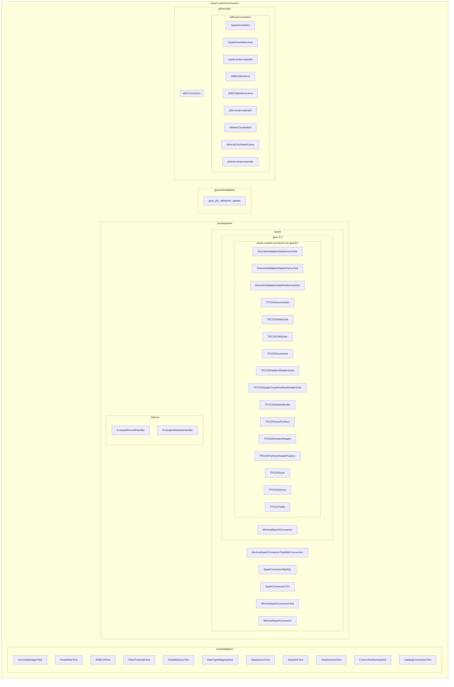

    

    <b>Automatic Architecture Diagrams from Code</b> 
    <a href="https://github.com/swark-io/swark">GitHub</a> • <a href="https://swark.io">Website</a> • <a href="mailto:contact@swark.io">Contact Us</a>

## Usage Instructions

1. **Render the Diagram**: Use the links below to open it in Mermaid Live Editor, or install the [Mermaid Support](https://marketplace.visualstudio.com/items?itemName=bierner.markdown-mermaid) extension.
2. **Recommended Model**: If available for you, use `claude-3.5-sonnet` [language model](vscode://settings/swark.languageModel). It can process more files and generates better diagrams.
3. **Iterate for Best Results**: Language models are non-deterministic. Generate the diagram multiple times and choose the best result.

## Generated Content
**Model**: GPT-4o - [Change Model](vscode://settings/swark.languageModel)  
**Mermaid Live Editor**: [View](https://mermaid.live/view#pako:eNrlVl1v2jAU_StRnptpUt9428K6DQ2JNrR9iYRu7Evi4tiRY8NQ1f8-J4F8gUPfh4Rw7jn32L732OHdJ5KiP_NjkSooMm89j4XnlSZpHn9yg6EptcxDKQQSLVVZEXoULgnwF-CMgmZSNKjnRUgU6nIJAlJUayz1GXlCoK-KaewHF_Pv4bPi_dAD4xrVSiFlBIbseaIh4fhoUB0HcdCwPha4hKJgIh1DkTSK4EWUid1FjGSYQz8aSm5ysQKlWbXNkXpoc7hMT0WyeAeioKOKUdwjl0WOos1vsagAtTtHPW_JBMuB19G2A5X2K9NZN1uXMGQuj9HjHxcYRi-fmOgGpYPbLaTWM8H9l68dNMy9v5LcS9cFoWVAatMF5EwNtvZbKY-EvdqiC5l0Drze6SnyRbMnyC4HNJ_1KpxHzeSRsRa_gq4r57rAZ8146QIjAsKFtcuqThcqp4RdNccwM2L3yYy6QBVWL21ImKr0VGFr4d-iMLpdxO0t3WY8QOWUo6Nyzka5etSPt4d49NAbtgb-pjMU0NF__IW84PiERCr6CwTl_c2c0CVqsCaDEd7qX94i6did55wK2LzJZLNvoY0p7ACnpEqiWKHLi90c7EUjjXbeNZGQhy2HHbriC9j3ilFWWNBMFmCz9w6t3gIRcCztaSfO-FDxjSbEKdj0IuTS0ANokrmRoSjUqEP2WtMPU_fx_1yj06D-8e_8HFUOjNp_HO-xbwVyjP2ZF_sUt2C4jv0PS2rcOmdga5v7M60M3vlgtIyOgpyflTRp5s-2wEv8-Aen9sXF) | [Edit](https://mermaid.live/edit#pako:eNrlVl1v2jAU_StRnptpUt9428K6DQ2JNrR9iYRu7Evi4tiRY8NQ1f8-J4F8gUPfh4Rw7jn32L732OHdJ5KiP_NjkSooMm89j4XnlSZpHn9yg6EptcxDKQQSLVVZEXoULgnwF-CMgmZSNKjnRUgU6nIJAlJUayz1GXlCoK-KaewHF_Pv4bPi_dAD4xrVSiFlBIbseaIh4fhoUB0HcdCwPha4hKJgIh1DkTSK4EWUid1FjGSYQz8aSm5ysQKlWbXNkXpoc7hMT0WyeAeioKOKUdwjl0WOos1vsagAtTtHPW_JBMuB19G2A5X2K9NZN1uXMGQuj9HjHxcYRi-fmOgGpYPbLaTWM8H9l68dNMy9v5LcS9cFoWVAatMF5EwNtvZbKY-EvdqiC5l0Drze6SnyRbMnyC4HNJ_1KpxHzeSRsRa_gq4r57rAZ8146QIjAsKFtcuqThcqp4RdNccwM2L3yYy6QBVWL21ImKr0VGFr4d-iMLpdxO0t3WY8QOWUo6Nyzka5etSPt4d49NAbtgb-pjMU0NF__IW84PiERCr6CwTl_c2c0CVqsCaDEd7qX94i6did55wK2LzJZLNvoY0p7ACnpEqiWKHLi90c7EUjjXbeNZGQhy2HHbriC9j3ilFWWNBMFmCz9w6t3gIRcCztaSfO-FDxjSbEKdj0IuTS0ANokrmRoSjUqEP2WtMPU_fx_1yj06D-8e_8HFUOjNp_HO-xbwVyjP2ZF_sUt2C4jv0PS2rcOmdga5v7M60M3vlgtIyOgpyflTRp5s-2wEv8-Aen9sXF)

