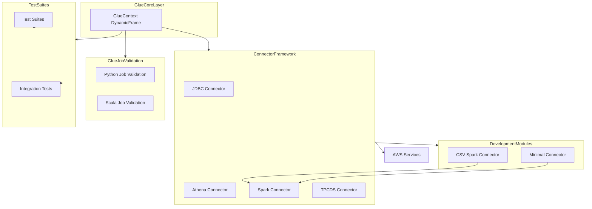

    

    <b>Automatic Architecture Diagrams from Code</b> 
    <a href="https://github.com/swark-io/swark">GitHub</a> • <a href="https://swark.io">Website</a> • <a href="mailto:contact@swark.io">Contact Us</a>

## Usage Instructions

1. **Render the Diagram**: Use the links below to open it in Mermaid Live Editor, or install the [Mermaid Support](https://marketplace.visualstudio.com/items?itemName=bierner.markdown-mermaid) extension.
2. **Recommended Model**: If available for you, use `claude-3.5-sonnet` [language model](vscode://settings/swark.languageModel). It can process more files and generates better diagrams.
3. **Iterate for Best Results**: Language models are non-deterministic. Generate the diagram multiple times and choose the best result.

## Generated Content
**Model**: o3-mini (Preview) - [Change Model](vscode://settings/swark.languageModel)  
**Mermaid Live Editor**: [View](https://mermaid.live/view#pako:eNp1U91OwjAYfZWm1_ICuzCpG-IQ5kInajou6vYhjVtLuhYlxne33UDEjYs16TnnO99f94ULVQIOcC7fNN9uUBblEqHGvnbXSWUhVBpmfA_aMwhNQtah0sCnQdFe8loUt5rXsPIKkGUuz0ycVEJhlG5FH0q_d07T6CZk_jgpVh1DsrtxQhgxG5C8x9KULO4Z3XL93uOyNIwoa89_XL8u38ZUvS55JUpuhJKdRfoyfbhh6d5slESORyfBsYCQzIgX0YJXfEjTT5ZBY6gVBprO4zGJM-ZB1KEH6zjJxpMFyeKHhMVuwi7Ym7bhzQXrCHZQqW0N0sxVaatjinmcxHMyY3MhRc2r3qxCumTuQ0OT_M0yfs7Gi8S5kCeKKOidKNpiPTcJ0Wh0fWG_fbQVH_3-xA_u4cCdj-2C5_AADu23ivbJtA6u3zPA72Eg05899Fh8hWvQNRel-3G-cuxeaQ05DlCOS1hzW5kcfzuR3bp2IBLcranGgdEWrjC3RtG9LI53rezbBgdrXjXw_QMOTDIU) | [Edit](https://mermaid.live/edit#pako:eNp1U91OwjAYfZWm1_ICuzCpG-IQ5kInajou6vYhjVtLuhYlxne33UDEjYs16TnnO99f94ULVQIOcC7fNN9uUBblEqHGvnbXSWUhVBpmfA_aMwhNQtah0sCnQdFe8loUt5rXsPIKkGUuz0ycVEJhlG5FH0q_d07T6CZk_jgpVh1DsrtxQhgxG5C8x9KULO4Z3XL93uOyNIwoa89_XL8u38ZUvS55JUpuhJKdRfoyfbhh6d5slESORyfBsYCQzIgX0YJXfEjTT5ZBY6gVBprO4zGJM-ZB1KEH6zjJxpMFyeKHhMVuwi7Ym7bhzQXrCHZQqW0N0sxVaatjinmcxHMyY3MhRc2r3qxCumTuQ0OT_M0yfs7Gi8S5kCeKKOidKNpiPTcJ0Wh0fWG_fbQVH_3-xA_u4cCdj-2C5_AADu23ivbJtA6u3zPA72Eg05899Fh8hWvQNRel-3G-cuxeaQ05DlCOS1hzW5kcfzuR3bp2IBLcranGgdEWrjC3RtG9LI53rezbBgdrXjXw_QMOTDIU)

