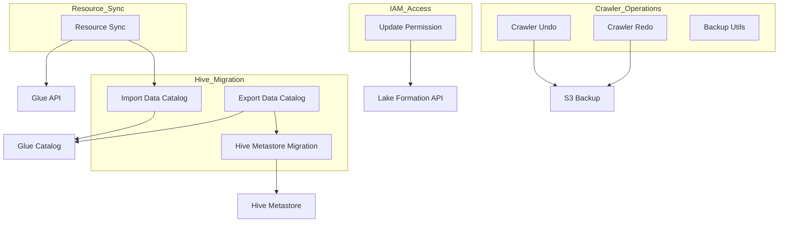

    

    <b>Automatic Architecture Diagrams from Code</b> 
    <a href="https://github.com/swark-io/swark">GitHub</a> • <a href="https://swark.io">Website</a> • <a href="mailto:contact@swark.io">Contact Us</a>

## Usage Instructions

1. **Render the Diagram**: Use the links below to open it in Mermaid Live Editor, or install the [Mermaid Support](https://marketplace.visualstudio.com/items?itemName=bierner.markdown-mermaid) extension.
2. **Recommended Model**: If available for you, use `claude-3.5-sonnet` [language model](vscode://settings/swark.languageModel). It can process more files and generates better diagrams.
3. **Iterate for Best Results**: Language models are non-deterministic. Generate the diagram multiple times and choose the best result.

## Generated Content
**Model**: o3-mini (Preview) - [Change Model](vscode://settings/swark.languageModel)  
**Mermaid Live Editor**: [View](https://mermaid.live/view#pako:eNptUk1vgkAQ_SuTPesBuXloYrFWE0mNlNNiyBZGIQJL9qO2Mf73LiwoWi9k9s17bz6YM0l4imRKompf8FOSMaHgcx5VAFJ_HQSrM1jN_HiWJChlAwOEDg3rlCmEDYoylzLn1a5JYZXeCbcouRYJxsFvlVjtNnBoD0MDPxUu82-M_dw8lPG2yqXv0FVZc9PfnCkGnvkU_LDrsxPaqMBHxaTiwkS9_kpx6dvPc4PHBjzBTgWK-KNG69GN7jm0S0FYpbxz9iZXdIs31KWvLDnqGkKVF3JYJ3RgPH6B9SKebVZ0zY4ICy7KthIYqOWaVbWs90Jjy2uCa9as45btRrGM4VxmLS3LLrRfzcOmOqb7z6_BPVsmcGM7DA1csFEr8yb36WHjpsWhs-klqsiIlOZoWJ6amztHRGVYYkSmEJEU90wXKiIXQ9Ltgc1zZv5HSaZKaBwRphVvbqZ_C64PGZnuWSHx8gfs0OnE) | [Edit](https://mermaid.live/edit#pako:eNptUk1vgkAQ_SuTPesBuXloYrFWE0mNlNNiyBZGIQJL9qO2Mf73LiwoWi9k9s17bz6YM0l4imRKompf8FOSMaHgcx5VAFJ_HQSrM1jN_HiWJChlAwOEDg3rlCmEDYoylzLn1a5JYZXeCbcouRYJxsFvlVjtNnBoD0MDPxUu82-M_dw8lPG2yqXv0FVZc9PfnCkGnvkU_LDrsxPaqMBHxaTiwkS9_kpx6dvPc4PHBjzBTgWK-KNG69GN7jm0S0FYpbxz9iZXdIs31KWvLDnqGkKVF3JYJ3RgPH6B9SKebVZ0zY4ICy7KthIYqOWaVbWs90Jjy2uCa9as45btRrGM4VxmLS3LLrRfzcOmOqb7z6_BPVsmcGM7DA1csFEr8yb36WHjpsWhs-klqsiIlOZoWJ6amztHRGVYYkSmEJEU90wXKiIXQ9Ltgc1zZv5HSaZKaBwRphVvbqZ_C64PGZnuWSHx8gfs0OnE)

