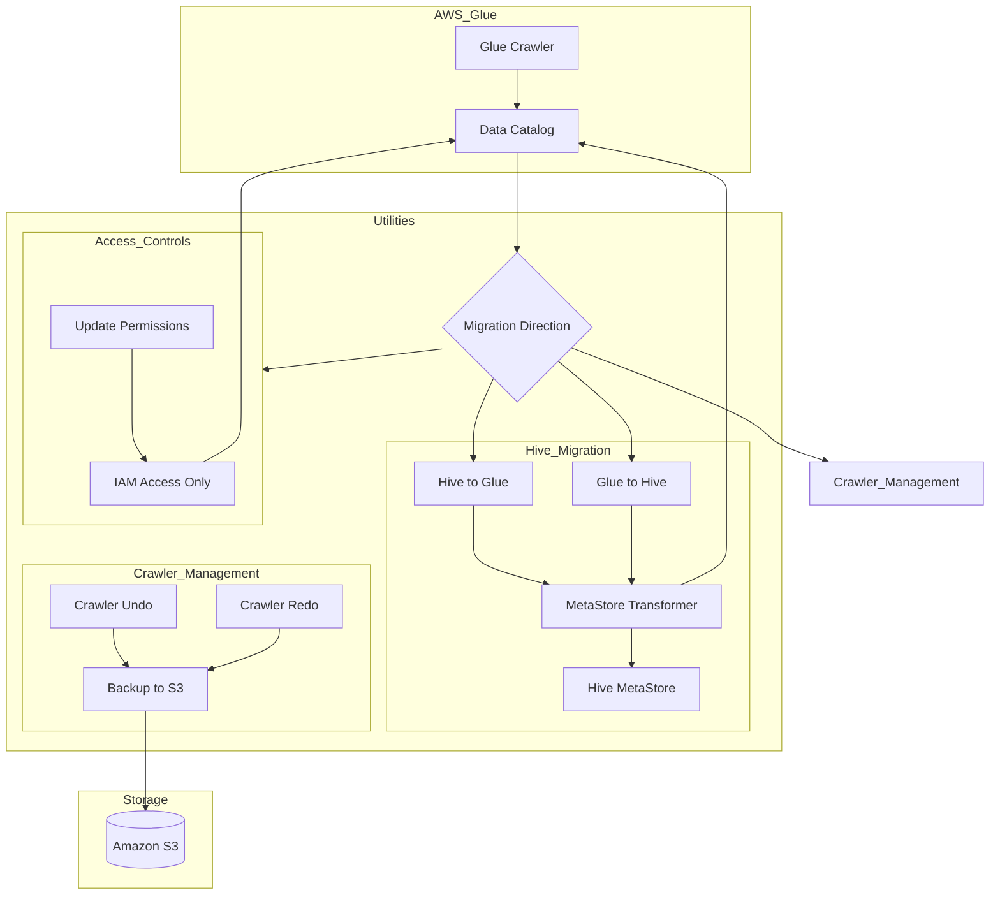

    

    <b>Automatic Architecture Diagrams from Code</b> 
    <a href="https://github.com/swark-io/swark">GitHub</a> • <a href="https://swark.io">Website</a> • <a href="mailto:contact@swark.io">Contact Us</a>

## Usage Instructions

1. **Render the Diagram**: Use the links below to open it in Mermaid Live Editor, or install the [Mermaid Support](https://marketplace.visualstudio.com/items?itemName=bierner.markdown-mermaid) extension.
2. **Recommended Model**: If available for you, use `claude-3.5-sonnet` [language model](vscode://settings/swark.languageModel). It can process more files and generates better diagrams.
3. **Iterate for Best Results**: Language models are non-deterministic. Generate the diagram multiple times and choose the best result.

## Generated Content
**Model**: Claude 3.5 Sonnet (Preview) - [Change Model](vscode://settings/swark.languageModel)  
**Mermaid Live Editor**: [View](https://mermaid.live/view#pako:eNqNVE1vozAU_CuWT63UnnLLoVIK6scBUdVEezARcuElsQp2ZJuuulH--9oYEwKNVB-ANzN5jJ-HHHEpK8BLnIudYoc9yuJcILt0--GB1R9SPNcteNitSLG_NSjq0FBsznQc0ZgZhiJ7qeWuZ0BUuZi0Xhtec8NBj37MFZSGS3FMuBW5pzN2Ch0uurzwLygG9Vng1ktSPL2nCXUaZCRyljczSZb6vViBE27QVEF8gwQMI0aqeQtSZIoJvZWqoYMKDdjFfEaTuNhHP8kiYYLtoAFhJj7WopK0V3XFxMY7jHhXTPhHVn62B-pvbrNk8Qtbq7IErYtICqNkrS9bvq6SIhX1N7UPvRK5evLm9aFiBoo3UI2mvkCu4FrbI9NTF9fy4qZqR3NWkwW9WTXsnw0JWdzOkxaGcX__YGPpsTjyZQhV0A5AR_fBQVe4LPVEkHl4lIKBztLr5AgKomuUc_-Tl3lovMrFoxP40_agy8QM7OPgYLL4-SWTCKB-KuNT7XQhDZ4O1eAf32H7JTSMV_b_5phjs7eGc7xEOa5gy9ra5PhkRW3XN-bMnnqDl0a1cIdZayT5FmWolWx3e7zcslrD6T_StHTO) | [Edit](https://mermaid.live/edit#pako:eNqNVE1vozAU_CuWT63UnnLLoVIK6scBUdVEezARcuElsQp2ZJuuulH--9oYEwKNVB-ANzN5jJ-HHHEpK8BLnIudYoc9yuJcILt0--GB1R9SPNcteNitSLG_NSjq0FBsznQc0ZgZhiJ7qeWuZ0BUuZi0Xhtec8NBj37MFZSGS3FMuBW5pzN2Ch0uurzwLygG9Vng1ktSPL2nCXUaZCRyljczSZb6vViBE27QVEF8gwQMI0aqeQtSZIoJvZWqoYMKDdjFfEaTuNhHP8kiYYLtoAFhJj7WopK0V3XFxMY7jHhXTPhHVn62B-pvbrNk8Qtbq7IErYtICqNkrS9bvq6SIhX1N7UPvRK5evLm9aFiBoo3UI2mvkCu4FrbI9NTF9fy4qZqR3NWkwW9WTXsnw0JWdzOkxaGcX__YGPpsTjyZQhV0A5AR_fBQVe4LPVEkHl4lIKBztLr5AgKomuUc_-Tl3lovMrFoxP40_agy8QM7OPgYLL4-SWTCKB-KuNT7XQhDZ4O1eAf32H7JTSMV_b_5phjs7eGc7xEOa5gy9ra5PhkRW3XN-bMnnqDl0a1cIdZayT5FmWolWx3e7zcslrD6T_StHTO)

