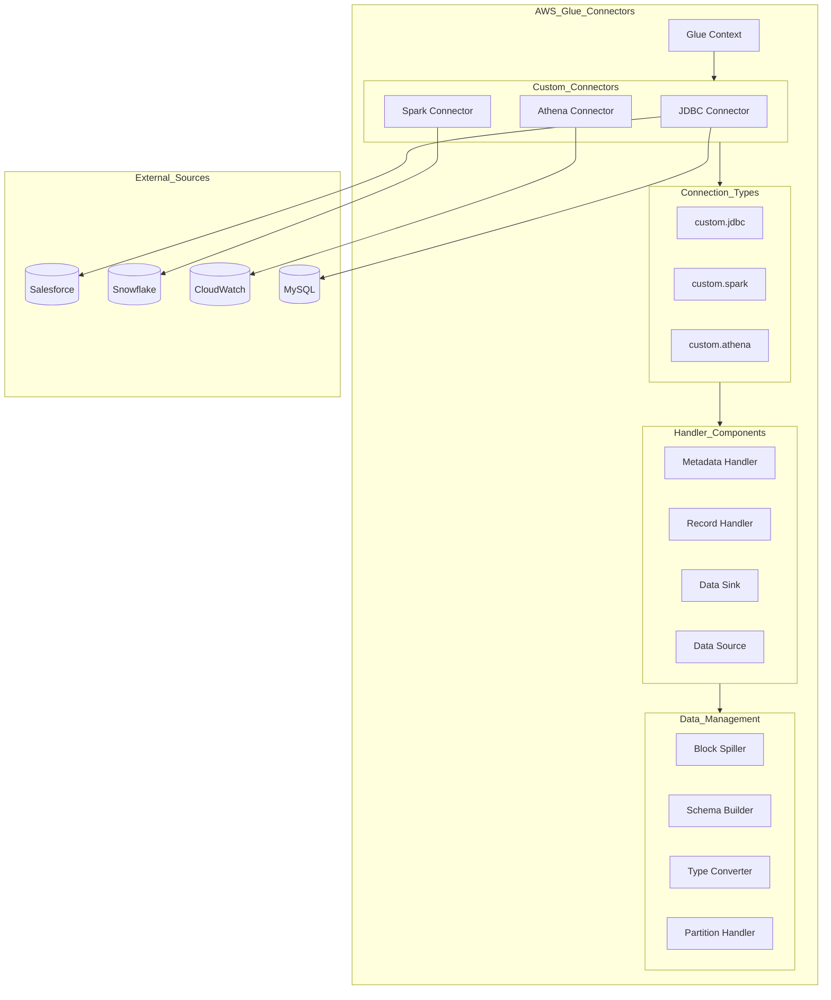

    

    <b>Automatic Architecture Diagrams from Code</b> 
    <a href="https://github.com/swark-io/swark">GitHub</a> • <a href="https://swark.io">Website</a> • <a href="mailto:contact@swark.io">Contact Us</a>

## Usage Instructions

1. **Render the Diagram**: Use the links below to open it in Mermaid Live Editor, or install the [Mermaid Support](https://marketplace.visualstudio.com/items?itemName=bierner.markdown-mermaid) extension.
2. **Recommended Model**: If available for you, use `claude-3.5-sonnet` [language model](vscode://settings/swark.languageModel). It can process more files and generates better diagrams.
3. **Iterate for Best Results**: Language models are non-deterministic. Generate the diagram multiple times and choose the best result.

## Generated Content
**Model**: Claude 3.5 Sonnet (Preview) - [Change Model](vscode://settings/swark.languageModel)  
**Mermaid Live Editor**: [View](https://mermaid.live/view#pako:eNqNlN2K2zAQhV9F6CqF3T5ALgqbpHQpDbT1wl7YwcxKk9iNLBlZajcs--7Vjx07igOrm8wZfRnOjGS9UaY40iUt5EFDW5GnTSGJW519iYmH56z8JiyWayUlMqN0Fwm__IbLG3w1uY9JL3YjMkbnkmvbGdXMFvTr-2a1HjdzL8lZ7i7ZrAV9nMBBT2hyiT-YCiVM-JiYLY-SF3LOfWRrJcunU4uJ-dib95yzEH7-w1_Ybg4KXgeq8yK1G7nocQAhqA_4fATJBWrXbNMqidIkTrdogIOBnssHPfwx8fwbmdJ8gKO6gW5clayWx9wHxEdzgLKaYY-E-AM9ebrcgoQDNq6jy6orodgxa2vhDQZBepVeGlZhAytbC-7IqEgvE9SfsDvwv6iNQ70iZ5mgP0Gb2l-LYUbnxMyYQoNJp5OPidzff7n1mVylIzx7K9NsQG9djOt8wK9mnjwQX1_dLCSIMp7i5JZlILDbK3_MizH-NBlDJtW_vYCjB4Zwur8WyvJnMKzKF2M8Jban7NePfBF-hvxkppdvSehndHITCdXibvLAxAqD1Yikj0o8j7PbQtI72qBuoObuoX0rqOMbLOiSFJTjHqwwBX13kG3d94ebGtxgG7o02uIdBWtUdpJs0FrZQ0WXexAdvv8HMrfXOw) | [Edit](https://mermaid.live/edit#pako:eNqNlN2K2zAQhV9F6CqF3T5ALgqbpHQpDbT1wl7YwcxKk9iNLBlZajcs--7Vjx07igOrm8wZfRnOjGS9UaY40iUt5EFDW5GnTSGJW519iYmH56z8JiyWayUlMqN0Fwm__IbLG3w1uY9JL3YjMkbnkmvbGdXMFvTr-2a1HjdzL8lZ7i7ZrAV9nMBBT2hyiT-YCiVM-JiYLY-SF3LOfWRrJcunU4uJ-dib95yzEH7-w1_Ybg4KXgeq8yK1G7nocQAhqA_4fATJBWrXbNMqidIkTrdogIOBnssHPfwx8fwbmdJ8gKO6gW5clayWx9wHxEdzgLKaYY-E-AM9ebrcgoQDNq6jy6orodgxa2vhDQZBepVeGlZhAytbC-7IqEgvE9SfsDvwv6iNQ70iZ5mgP0Gb2l-LYUbnxMyYQoNJp5OPidzff7n1mVylIzx7K9NsQG9djOt8wK9mnjwQX1_dLCSIMp7i5JZlILDbK3_MizH-NBlDJtW_vYCjB4Zwur8WyvJnMKzKF2M8Jban7NePfBF-hvxkppdvSehndHITCdXibvLAxAqD1Yikj0o8j7PbQtI72qBuoObuoX0rqOMbLOiSFJTjHqwwBX13kG3d94ebGtxgG7o02uIdBWtUdpJs0FrZQ0WXexAdvv8HMrfXOw)

